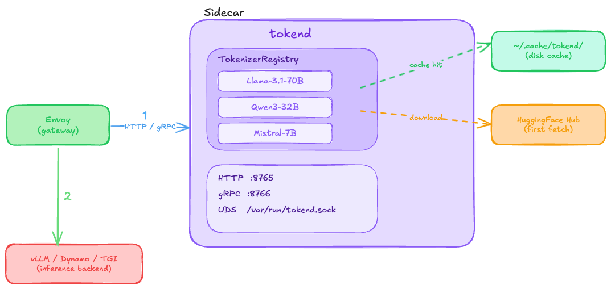

# tokend Design

## Problem

Every inference gateway needs tokenization. Prefix-cache-aware routing requires token IDs
to compute cache keys. Rate limiting gates on token counts. Request costing bills by
tokens produced. Without token IDs you cannot route intelligently — you are hashing raw
bytes, which changes with whitespace and encoding, and you miss prefix matches entirely.

The problem is where tokenization lives today: inside the inference backend. vLLM, Dynamo,
TGI, and TensorRT-LLM each embed their own tokenizer, reachable only through their own
API. A gateway that needs token IDs before dispatching a request must either call into
the backend (adding a round trip), maintain its own in-process copy of every model's
tokenizer (coupling the gateway binary to every model variant in the fleet), or skip
tokenization and route blind.

tokend breaks this coupling. It runs as a standalone process — sidecar to Envoy or
any custom proxy — and exposes tokenization over HTTP (TCP and Unix domain socket),
gRPC, and Envoy ext_proc. The gateway sends text, receives token IDs and counts, and
dispatches to whatever backend it chooses. The inference backend is irrelevant. Multiple
tokenizers load concurrently in a single daemon; the registry is lock-minimized via
`DashMap` with shard locks dropped before encoding work begins.

### What tokend is not

tokend does not run inference. It does not manage GPU resources. It does not speak the
OpenAI API. It tokenizes text and returns token IDs.

---

## Architecture



The gateway queries tokend over UDS (lowest latency, same host) or TCP (cross-node).
tokend holds every tokenizer in memory. Tokenization is CPU-only and completes in
microseconds — no GPU involvement, no inference engine dependency.

### Transport layers

tokend binds four listeners concurrently:

| Transport | Default | Use case |
|---|---|---|
| HTTP over UDS | `/var/run/tokend.sock` | Same-host sidecar — lowest latency, no TCP stack |
| HTTP over TCP | `:8765` | Cross-node callers, health checks, Prometheus scrape |
| gRPC over TCP | `:8766` | Structured RPC for gateways that prefer protobuf |
| Envoy ext_proc | `:8767` | In-band tokenization for Envoy's external processing filter |

All transports share the same tokenizer registry and metrics. The UDS and TCP HTTP
listeners share the same axum router. The gRPC listener runs a separate tonic service
with equivalent RPCs. The ext_proc listener implements the Envoy `ExternalProcessor`
gRPC service for transparent request interception.

### Tokenizer registry

The registry is a `DashMap<String, Arc<Tokenizer>>` — a sharded concurrent hash map.
Key design decisions:

- **Shard lock dropped before encoding**: the `DashMap::get()` call returns a `Ref` that
  holds the shard lock. The code clones the `Arc<Tokenizer>` and drops the `Ref` before
  calling `encode_batch`. Concurrent requests to different models never contend.
- **Arc clone on hot path**: the `Arc::clone` is a single atomic increment. The tokenizer
  data (vocab tables, merge rules) is not copied.
- **Load/unload at runtime**: `POST /tokenizers/load` and `DELETE /tokenizers/{model}`
  mutate the registry without restart. The loaded-models gauge updates atomically.

### Chat template support

HuggingFace models include a Jinja2 chat template in `tokenizer_config.json` that defines
how multi-turn conversations are rendered into a flat prompt string. Different model
families use different template syntax — ChatML (`<|im_start|>`), Llama (`[INST]`),
Mistral, and many variants.

tokend loads these templates at startup using the `minijinja` crate (a Rust-native Jinja2
implementation). The template is compiled once and cached alongside the tokenizer in a
parallel `DashMap<String, Arc<ChatTemplate>>`. On each `chat_tokenize` call:

1. Render messages through the compiled template (microsecond-scale)
2. Tokenize the rendered string
3. Return token IDs, count, and render latency separately

This two-step pipeline is exposed both via the `/v1/chat/tokenize` HTTP endpoint and
implicitly through ext_proc when intercepting `/v1/chat/completions` requests.

The template engine supports:
- `bos_token` / `eos_token` injection from `tokenizer_config.json`
- `add_generation_prompt` to append the assistant turn start marker
- `tools` parameter for function-calling templates
- Jinja2 control flow: ``, ``, filters, macros

### HuggingFace Hub integration

For `source: huggingface` tokenizers, the load path is:

1. Check the local disk cache (`cache_dir / url_encoded(model_name) / tokenizer.json`).
2. If cached, load from disk — no network.
3. If not cached, call `Tokenizer::from_pretrained` with optional `HF_TOKEN`.
4. Save the result to disk cache for subsequent starts.
5. Fetch `tokenizer_config.json` for the chat template (best-effort).

This means the first start downloads from HF Hub; subsequent starts are fully offline.
Gated models (Llama, Gemma) require `HF_TOKEN` set in the environment or config.

---

## Envoy ext_proc

The ext_proc integration makes tokend a transparent tokenization sidecar. Envoy's
external processing filter streams every matching request through tokend before
forwarding it to the upstream backend. The application (and the backend) don't need
to know tokend exists.

### Protocol

The `ExternalProcessor::Process` RPC is a bidirectional stream — one stream per HTTP
request flowing through Envoy.

```
Envoy                           tokend ext_proc
  │                                  │
  │── RequestHeaders ───────────────>│  Check :path against intercept_paths
  │<── CONTINUE ────────────────────│
  │                                  │
  │── RequestBody (buffered) ───────>│  Parse JSON, extract model + messages/prompt
  │                                  │  Tokenize (chat template if messages, raw if prompt)
  │<── BodyResponse + mutations ────│  Inject headers/body per configured mode
  │                                  │
  │── ResponseHeaders ──────────────>│  CONTINUE (passthrough)
  │<── CONTINUE ────────────────────│
```

### Payload dispatch

The ext_proc handler dispatches on the JSON body shape, not the URL path:

| Body field | Endpoint | Action |
|---|---|---|
| `messages` present | `/v1/chat/completions` | Apply chat template, then tokenize |
| `prompt` present | `/v1/completions` | Raw tokenize (no template) |
| Neither | — | Fail-open with `x-tokend-error` header |

### Mutation modes

- **Headers**: `x-tokend-token-count` and `x-tokend-model` injected as request headers.
  Envoy can use these for routing, rate limiting, or load balancing decisions.
- **Body**: the JSON body is mutated to add `token_count` (and optionally `token_ids`
  when `inject_tokens: true`). Content-Length is updated to match the new body size.
- **Both**: headers + body mutation simultaneously.

### Design decisions

- **Fail-open**: if tokenization fails (bad JSON, model not loaded, template error), the
  request passes through with an `x-tokend-error` header. Production traffic is never
  blocked by a sidecar token counter.
- **Stateless per-stream**: each bidirectional stream is independent. No cross-request
  state. The `AppState` (registry, metrics, config) is shared via Arc.
- **Path filtering**: only paths in `intercept_paths` trigger body inspection. All other
  requests get a fast CONTINUE with no body buffering.
- **Phase-correct responses**: each `ProcessingResponse` variant matches the request phase.
  `RequestHeaders` → `ExtResponse::RequestHeaders`, `ResponseHeaders` →
  `ExtResponse::ResponseHeaders`, etc. Mismatches cause Envoy "spurious response" errors.
- **Content-Length consistency**: when mutating the request body, the Content-Length header
  is updated in the same response. Envoy enforces content-length/body-size consistency
  and returns 500 on mismatch.

---

## Performance

tokend targets sub-millisecond tokenization per call on CPU. The implementation:

- **Lock minimization**: `DashMap` shards the tokenizer registry; the shard lock is dropped
  before encoding begins. Concurrent requests to different models do not contend.
- **Zero-copy on hot path**: the `Arc<Tokenizer>` clone from the registry increments a
  reference count. The tokenizer data itself is not copied.
- **HuggingFace `tokenizers` crate**: the underlying tokenizer library (Rust, from HuggingFace)
  runs BPE and WordPiece in native code with SIMD where available.
- **Batch support**: a single HTTP or gRPC call can tokenize multiple texts; the response
  is built with a single allocation per batch.
- **Compiled chat templates**: minijinja compiles each template once at load time. Render
  calls during tokenization are microsecond-scale (typically 2-10us).

The `tokend bench` command measures throughput against all loaded models:

```
tokend bench — 3 model(s), 1000 iterations each

  meta-llama/Llama-3.1-70B-Instruct
    1000 iterations in 48.3ms
    48.3 us/call, 829,876 tokens/sec
    829 total tokens (829 tokens/call)

  Qwen/Qwen3-32B
    1000 iterations in 51.7ms
    51.7 us/call, 775,194 tokens/sec
    801 total tokens (801 tokens/call)

  mistralai/Mistral-7B-Instruct-v0.3
    1000 iterations in 44.1ms
    44.1 us/call, 907,029 tokens/sec
    840 total tokens (840 tokens/call)
```

The latency histogram exposed at `/metrics` uses microsecond buckets (10 - 10,000 us)
so p50/p99 are readable at production traffic levels.

---

## Comparison

| System | Standalone tokenization service | Multiple concurrent models | Hot-load/unload | gRPC API | UDS transport | Envoy ext_proc | Chat templates |
|---|---|---|---|---|---|---|---|
| **tokend** | yes | yes | yes | yes | yes | yes | yes |
| vLLM | no — embedded, OpenAI API only | no | no | no | no | no | yes |
| Dynamo | no — embedded in router | partial | no | partial | no | no | yes |
| TGI | no — embedded, REST only | no | no | no | no | no | yes |
| TensorRT-LLM | no — embedded in triton backend | no | no | via triton | no | no | partial |

The pattern missing from all existing systems: a process whose only job is tokenization,
reachable by any gateway regardless of which inference backend serves the request.

---

## Deployment

### Sidecar to an inference gateway

tokend runs as a sidecar in the same Kubernetes pod as the inference gateway (Envoy,
a custom proxy, etc). The gateway queries tokend over UDS before dispatching each
request — no TCP stack overhead, no extra network hop.

```yaml
# Partial pod spec — gateway + tokend sidecar
containers:
  - name: gateway
    image: envoyproxy/envoy:latest
    volumeMounts:
      - name: tokend-socket
        mountPath: /var/run

  - name: tokend
    image: ghcr.io/your-org/tokend:latest
    args: ["-c", "/etc/tokend/tokend.yaml", "serve"]
    env:
      - name: HF_TOKEN
        valueFrom:
          secretKeyRef:
            name: hf-credentials
            key: token
    ports:
      - containerPort: 8765  # HTTP (for health checks)
      - containerPort: 8766  # gRPC (for cross-node callers)
      - containerPort: 8767  # ext_proc (for Envoy)
    readinessProbe:
      httpGet:
        path: /ready
        port: 8765
      initialDelaySeconds: 30  # allow time for HF Hub downloads on cold start
      periodSeconds: 5
    volumeMounts:
      - name: tokend-socket
        mountPath: /var/run
      - name: tokend-cache
        mountPath: /var/cache/tokend
      - name: tokend-config
        mountPath: /etc/tokend

volumes:
  - name: tokend-socket
    emptyDir: {}
  - name: tokend-cache
    persistentVolumeClaim:
      claimName: tokend-model-cache
  - name: tokend-config
    configMap:
      name: tokend-config
```

The gateway connects to tokend via `/var/run/tokend.sock` for direct tokenization calls,
or via `localhost:8767` for Envoy ext_proc. The UDS path crosses the shared `emptyDir`
volume — no port allocation, no loopback traffic.

### Envoy ext_proc sidecar

When running as an Envoy ext_proc sidecar, Envoy's filter chain handles the integration
transparently. No application code changes required — Envoy intercepts matching requests,
streams them to tokend for tokenization, and forwards the mutated request to the backend.

See [examples/](../examples/) for a working Docker Compose demo with Envoy + tokend + httpbin.
